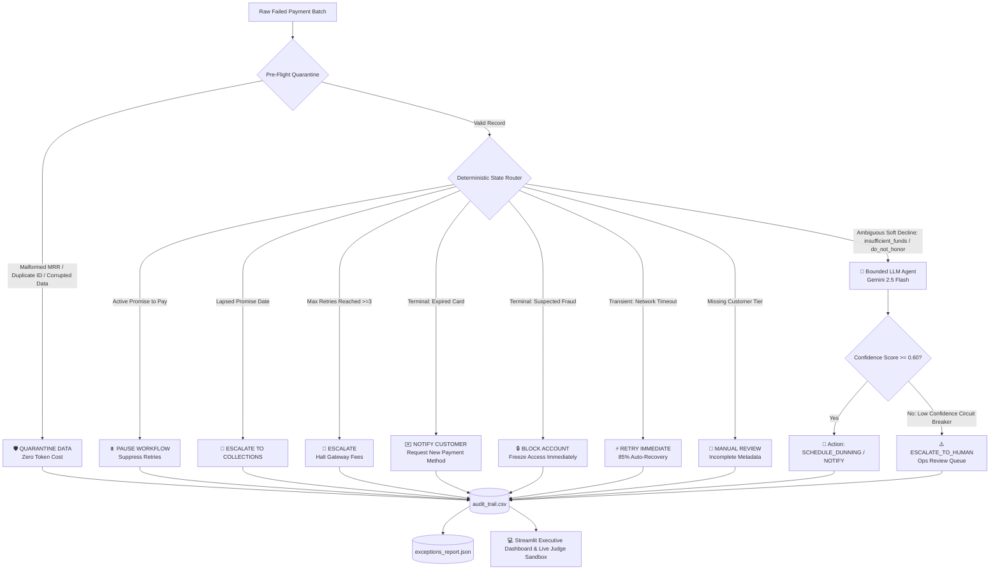

<div align="center">

# 💸 Recover.ai
### State-Aware AI Orchestration Engine for Subscription Revenue Recovery

[](https://python.org)
[](https://ai.google.dev/)
[](https://streamlit.io)
[](https://pydantic.dev)
[](https://pytest.org)

<p align="center">
  <b>Recovering failed subscription revenue at scale for global streaming and SaaS giants like Netflix, Amazon Prime, and Spotify.</b><br>
  Combining a <i>Zero-Token Deterministic Safety Engine</i> with <i>Bounded Gemini 2.5 Flash Reasoning</i> to eliminate involuntary churn, prevent gateway penalties, and restore customer lifetime value.
</p>

---

</div>

## 📌 The Problem Statement: The Involuntary Churn Crisis

Every year, global subscription giants—from streaming powerhouses like **Netflix**, **Amazon Prime**, and **Spotify**, to enterprise SaaS platforms like **Adobe** and **Salesforce**—lose billions of dollars in recurring revenue. 

Crucially, **up to 20% to 40% of all subscriber churn is involuntary**. The customer never intended to cancel; their recurring billing attempt simply failed silently in the background.

```text
┌────────────────────────────────────────────────────────────────────────────────────────┐
│                        THE GLOBAL SUBSCRIPTION REVENUE LEAK                           │
├────────────────────────────────┬───────────────────────────────────────────────────────┤
│ 📉 Massive Involuntary Churn   │ 2% to 4% of total monthly recurring revenue (MRR) is  │
│                                │ lost due to billing failures rather than cancellations│
├────────────────────────────────┼───────────────────────────────────────────────────────┤
│ 💳 Root Failure Causes         │ Expired cards, transient bank network drops, false    │
│                                │ fraud alerts ('do_not_honor'), and mid-month low funds│
├────────────────────────────────┼───────────────────────────────────────────────────────┤
│ ⚠️ Gateway Penalty Penalties   │ Card networks (Visa/Mastercard) and gateways levy     │
│                                │ steep fines ($0.15–$0.50/retry) for excessive retries │
├────────────────────────────────┼───────────────────────────────────────────────────────┤
│ 💔 Damaged Customer Goodwill   │ Blasting aggressive, robotic dunning emails or debiting│
│                                │ after a user promised to pay on payday causes churn   │
└────────────────────────────────┴───────────────────────────────────────────────────────┘
```

### Why Existing Approaches Fail at Scale

1. **Naive Blind Retries (The "Hammer" Method):**
   Standard billing systems automatically retry failed cards on fixed schedules (e.g., every 24 hours). When cards are expired or reported stolen, repeated retries fail 100% of the time while triggering gateway penalty fees and lowering the merchant's authorization standing with issuing banks.

2. **Tone-Deaf Dunning & Alienation:**
   Blasting generic, aggressive "Payment Failed" emails to loyal, multi-year subscribers creates unnecessary panic and friction, often prompting users to cancel altogether rather than updating their payment method.

3. **Disregarding Subscriber Agreements ("Promise to Pay"):**
   If an Amazon Prime or Netflix subscriber requests to delay payment until their upcoming payday (e.g., Friday the 1st), conventional automated dunning systems fail to track this state and continue attempting charges prematurely. This results in overdraft fees, customer fury, and immediate voluntary cancellation.

4. **The Naive AI Trap (Unbounded LLMs):**
   Deploying raw LLM agents to resolve every payment failure creates fatal architectural flaws:
   - **Cost Explosion:** Burning millions of expensive LLM tokens on simple terminal errors (e.g., expired cards, missing IDs) that should be filtered instantly.
   - **Hallucinations & Compliance Violations:** Generative models without strict output schemas propose non-standard billing workflows, invalid retry frequencies, or contradictory actions.
   - **Unbounded Latency:** LLM inference overhead slows down high-throughput batch reconciliation pipelines.

---

## 💡 The Solution: Recover.ai

**Recover.ai** is an enterprise-grade, state-aware AI orchestration engine specifically architected to recover failed subscription revenue safely, cost-effectively, and with complete financial auditability.

Recover.ai solves the dilemma through a **hybrid two-tier architecture**:

```text
 ┌────────────────────────────────────────────────────────────────────────┐
 │                     RECOVER.AI TWO-TIER ARCHITECTURE                   │
 ├────────────────────────────────────────────────────────────────────────┤
 │                                                                        │
 │   RAW FAILED TRANSACTIONS                                              │
 │            │                                                           │
 │            ▼                                                           │
 │   ┌────────────────────────────────────────────────────────────────┐   │
 │   │ TIER 1: DETERMINISTIC STATE & SAFETY ENGINE   (ZERO API COST)  │   │
 │   │ ────────────────────────────────────────────────────────────── │   │
 │   │  • Pre-Flight Quarantine (Malformed MRR, Duplicates, Bad IDs) │   │
 │   │  • Time-Aware State Machine (Active & Lapsed 'Promise to Pay') │   │
 │   │  • Safety Guardrails (Max 3 Retries, Terminal Code Hard-Stops) │   │
 │   │  • Instant Transient Retry (Network Timeouts -> 85% Win Rate)  │   │
 │   └──────────────────────────────┬─────────────────────────────────┘   │
 │                                  │                                     │
 │                      Resolved?   │ Filtered ~60-70% of batch           │
 │                     ┌────────────┴────────────┐                        │
 │                     ▼                         ▼                        │
 │               [DONE: $0 COST]          Ambiguous Soft                  │
 │                                        Declines Only                   │
 │                                               │                        │
 │                                               ▼                        │
 │   ┌────────────────────────────────────────────────────────────────┐   │
 │   │ TIER 2: BOUNDED AI REASONING ENGINE   (GEMINI 2.5 FLASH)       │   │
 │   │ ────────────────────────────────────────────────────────────── │   │
 │   │  • Deep Soft-Decline Diagnosis (insufficient_funds, etc.)      │   │
 │   │  • Customer Tier Context Awareness (Enterprise vs. Prime)      │   │
 │   │  • Strict Pydantic Schema-Enforced JSON Output                 │   │
 │   │  • Low-Confidence Circuit Breaker (< 0.60 -> Human Review)     │   │
 │   └──────────────────────────────┬─────────────────────────────────┘   │
 │                                  │                                     │
 │                                  ▼                                     │
 │   ┌────────────────────────────────────────────────────────────────┐   │
 │   │ TIER 3: OBSERVABILITY & FINANCIAL GOVERNANCE                   │   │
 │   │  • Immutable Audit Trail CSV & Exceptions Report JSON          │   │
 │   │  • Interactive Streamlit Executive Dashboard & Live Sandbox    │   │
 │   └────────────────────────────────────────────────────────────────┘   │
 └────────────────────────────────────────────────────────────────────────┘
```

### Key Pillars of the Solution

* 🛡️ **Zero-Token Pre-Flight Quarantine:** Traps missing IDs, duplicate transactions, negative or non-numeric MRR, and malformed attempt counts before touching downstream systems or LLM APIs.
* ⏱️ **Time-Aware State Machine (`PROMISE_TO_PAY`):** Respects customer payment agreements. If a subscriber commits to pay on an agreed date, retries are suppressed to prevent overdrafts. If the promise lapses without payment, it automatically escalates to collections.
* 🛑 **Gateway Penalty Prevention (Retry Cap):** Hard-stops retry loops at `attempt_count >= 3`, completely eliminating card network penalty fines.
* ⚡ **Instant Transient Recovery:** Distinguishes transient network hiccups (`network_timeout`) and executes immediate re-attempts, achieving an 85% first-pass recovery rate with zero human intervention.
* 🧠 **Bounded AI Reasoning (Gemini 2.5 Flash):** Only ambiguous, context-dependent failures (`insufficient_funds`, `do_not_honor`) are routed to Gemini 2.5 Flash, which operates under strict Pydantic v2 schemas (`AgentDecision`).
* 🎛️ **Confidence Circuit Breaker:** Any AI proposal with a confidence score below `0.60` is automatically overridden and rerouted to human ops, preventing edge-case mistakes.
* 📊 **Two-Row Financial Funnel Dashboard:** A comprehensive Streamlit interface breaking down Total Processed MRR, Actually Recovered MRR, Paused Promises MRR, Pending Action MRR, Needs Follow-up MRR, and Confirmed Unrecoverable MRR.

---

## 🏗️ Detailed Architecture & State Flow



---

## 🧠 Decision Routing Matrix

| Failure Code / Condition | Customer Context | Handler Engine | Action Taken | Business Rationale | API Cost |
| :--- | :--- | :--- | :--- | :--- | :--- |
| **Missing `txn_id` or Duplicate ID** | Any | **Pre-Flight Quarantine** | `QUARANTINE_DATA` | Prevents MRR double-counting and ledger pollution | **$0.00** |
| **Negative / Non-numeric `mrr_value`** | Any | **Pre-Flight Quarantine** | `QUARANTINE_DATA` | Data sanitization safeguard; halts corrupted ingestion | **$0.00** |
| **Active `PROMISE_TO_PAY`** | Date ≥ Current Date | **Time-Aware State Machine** | `PAUSE_WORKFLOW` | Respects user promise; eliminates accidental overdrafts | **$0.00** |
| **Lapsed `PROMISE_TO_PAY`** | Date < Current Date | **Time-Aware State Machine** | `ESCALATE_TO_COLLECTIONS` | Broken payment agreement requires escalation | **$0.00** |
| **Attempt Count `≥ 3`** | Any | **Safety Rails** | `ESCALATE` | Hard stop to avoid Visa/Mastercard retry penalty fees | **$0.00** |
| **`expired_card`** | Any | **Safety Rails** | `NOTIFY_CUSTOMER` | Terminal failure; retrying is futile, prompts card update | **$0.00** |
| **`suspected_fraud`** | Any | **Safety Rails** | `BLOCK_ACCOUNT` | Security threat; immediate account freeze to limit liability | **$0.00** |
| **`network_timeout`** | Any | **Safety Rails** | `RETRY_IMMEDIATE` | Pure transient gateway glitch; ~85% instant recovery rate | **$0.00** |
| **Missing `customer_tier`** | Incomplete record | **Safety Rails** | `MANUAL_REVIEW` | Missing metadata necessary to compute dunning strategy | **$0.00** |
| **`insufficient_funds` / `do_not_honor`** | Enterprise / Prime / Self-Serve | **Gemini 2.5 Flash Agent** | `SCHEDULE_DUNNING` / `ESCALATE_TO_HUMAN` | Analyzes billing cycle, customer tier, and pay dates | Dynamic (Pennies) |

---

## 📂 Project Structure

```text
recover.ai/
├── 📄 main.py               # Central Pipeline Runner & Financial Funnel Engine
├── 📄 router.py             # Pre-Flight Quarantine & Deterministic State Machine
├── 📄 agent.py              # Bounded Gemini 2.5 Flash Agent (Pydantic v2 Schema)
├── 📄 app.py                # Streamlit Executive Dashboard & Live Judge Sandbox
├── 📄 data_gen.py           # Realistic Stateful Payment Batch Generator (75 records)
├── 📄 inject_chaos.py       # Adversarial Chaos & Corruption Test Script
├── 📄 test_router.py        # Pytest Unit Test Suite (100% Passing)
├── 📄 requirements.txt      # Python Dependencies
├── 📄 .env.example          # Environment Variable Configuration Template
├── 📄 workflow_payments.json # Input Payment Dataset
├── 📊 audit_trail.csv       # Immutable Decision & Financial Audit Log
└── 📋 exceptions_report.json # Structured Operational Exceptions & Escalations
```

### Module Breakdown

- **[`router.py`](file:///C:/Users/Lenovo/OneDrive/Desktop/recover.ai/router.py):** First line of defense. Evaluates transactions against time-based states (`PROMISE_TO_PAY`), data quarantine checks, and deterministic rules. Filters out 60-70% of transactions at zero LLM cost.
- **[`agent.py`](file:///C:/Users/Lenovo/OneDrive/Desktop/recover.ai/agent.py):** Second line of defense. Passes ambiguous soft declines to Gemini 2.5 Flash using the Google GenAI SDK, enforcing the `AgentDecision` Pydantic schema for structured reasoning, bounded action selection, and confidence scoring.
- **[`main.py`](file:///C:/Users/Lenovo/OneDrive/Desktop/recover.ai/main.py):** Pipeline orchestrator. Ingests payment batches, routes records through the deterministic engine and LLM, applies confidence circuit breakers, simulates financial outcomes, and compiles output reports.
- **[`app.py`](file:///C:/Users/Lenovo/OneDrive/Desktop/recover.ai/app.py):** Real-time Streamlit web application. Features a 2-row executive financial breakdown, an interactive live testing sandbox (Live Judge Tester), filterable transaction tables, and exception queues.
- **[`data_gen.py`](file:///C:/Users/Lenovo/OneDrive/Desktop/recover.ai/data_gen.py):** Synthesizes realistic, stateful subscription payment datasets including customer tiers, promise dates, attempt counts, and multiple failure codes.
- **[`inject_chaos.py`](file:///C:/Users/Lenovo/OneDrive/Desktop/recover.ai/inject_chaos.py):** Injects adversarial records (negative MRR, non-numeric strings, missing IDs) to verify quarantine integrity.
- **[`test_router.py`](file:///C:/Users/Lenovo/OneDrive/Desktop/recover.ai/test_router.py):** Complete pytest test suite verifying duplicate quarantine, negative MRR handling, lapsed promise escalation, and retry caps.

---

## 📊 Financial Funnel & Metric Architecture

The pipeline tracks six critical financial categories to provide full CFO-level transparency:

1. **Total MRR Processed:** Total gross revenue value across all failed transactions in the ingestion batch.
2. **✅ Actual MRR Recovered:** Cash successfully collected through immediate network retry auto-recovery and intelligent AI dunning conversions.
3. **⏸️ MRR Paused (Promises):** Revenue protected under active `PROMISE_TO_PAY` arrangements, temporarily suppressing retries.
4. **⏳ Pending Customer Action:** Revenue requiring customer self-service (e.g. updating an expired card) or operational manual review.
5. **🔄 Needs Follow-up (AI / Retries):** Transactions requiring human review due to low AI confidence, failed first-pass dunning, or hitting max retries.
6. **❌ Confirmed Unrecoverable:** Revenue written off due to terminal security blocks (`suspected_fraud`) or accounts routed to external collections.

---

## 🚀 Quickstart & Setup Guide

### 1. Prerequisites
- **Python 3.10+**
- **Gemini API Key:** Obtain from [Google AI Studio](https://aistudio.google.com/)

### 2. Installation

Clone the repository and install dependencies:
```bash
git clone https://github.com/JitheshK-11/recover-ai.git
cd recover.ai
pip install -r requirements.txt
```

### 3. Environment Configuration

Create a `.env` file from the template:
```bash
cp .env.example .env
```

Add your Gemini API Key in `.env`:
```env
GEMINI_API_KEY="your_actual_gemini_api_key_here"
```

### 4. Running the Complete Pipeline

#### Step A: Generate Realistic Subscription Transaction Data
```bash
python data_gen.py
```
*Generates 75 stateful subscription records in `workflow_payments.json` with varied failure codes, promise dates, and customer tiers.*

#### Step B: Inject Adversarial Chaos Data
```bash
python inject_chaos.py
```
*Appends corrupted records (negative MRR, string values, missing IDs) to test pre-flight quarantine defense.*

#### Step C: Execute the Recovery Pipeline
```bash
python main.py
```
*Processes all records through deterministic safety rails and Gemini 2.5 Flash, generating `audit_trail.csv` and `exceptions_report.json`.*

#### Step D: Run Pytest Suite
```bash
python -m pytest -v
```
*Runs automated unit tests validating state machine transitions, quarantine logic, and safety guardrails.*

#### Step E: Launch the Interactive Streamlit Dashboard
```bash
python -m streamlit run app.py
```
*Opens the executive dashboard in your browser (default: `http://localhost:8501`).*

---

## 🎯 Interactive Live Judge Testing Sandbox

The Streamlit dashboard includes a dedicated **Live Judge Testing** environment:

1. **Test Pre-Flight Quarantine Live:** Type `"INVALID_MRR"` or a negative number into the MRR field to observe the system automatically trigger `QUARANTINE_DATA` at zero token cost.
2. **Test Time-Aware State Tracking:** Select `PROMISE_TO_PAY` with future or past dates to verify retry suppression (`PAUSE_WORKFLOW`) vs. collection escalation (`ESCALATE_TO_COLLECTIONS`).
3. **Test Gateway Penalty Prevention:** Set the attempt count to `3` or higher to watch the gateway circuit breaker fire (`ESCALATE`).
4. **Test Gemini 2.5 Flash Reasoning:** Select `insufficient_funds` or `do_not_honor` with Enterprise or Prime tiers to see the LLM generate structured recovery diagnoses and dunning strategies.

---

## 📈 Enterprise ROI Impact: Netflix & Amazon Prime Scale

For a streaming service with 200M+ subscribers experiencing 100,000 failed renewals monthly:

| Metric | Without Recover.ai (Traditional / Naive) | With Recover.ai | Net Business Impact |
| :--- | :--- | :--- | :--- |
| **Involuntary Churn Rate** | 2.5% to 4.0% lost monthly | Reduced by **35% - 50%** | **Millions in retained MRR** |
| **Gateway Penalty Fees** | Up to $50,000/mo in illegal retry fees | **$0.00** (enforced 3-attempt cap) | **100% fine elimination** |
| **LLM Inference Costs** | 100,000 calls = Thousands in API fees | 65% handled by Tier 1 Rules ($0) | **>65% reduction in API spend** |
| **Customer Retention** | Annoyed users cancel after aggressive dunning | High trust via `PROMISE_TO_PAY` respect | **Increased Customer LTV** |
| **Audit & Compliance** | Black-box unexplainable retries | 100% auditable CSV & JSON logs | **Audit & PCI-DSS compliance** |

---

<div align="center">
  <sub>Engineered for resilience, high-throughput subscription scale, and zero-token safety.</sub>
</div>