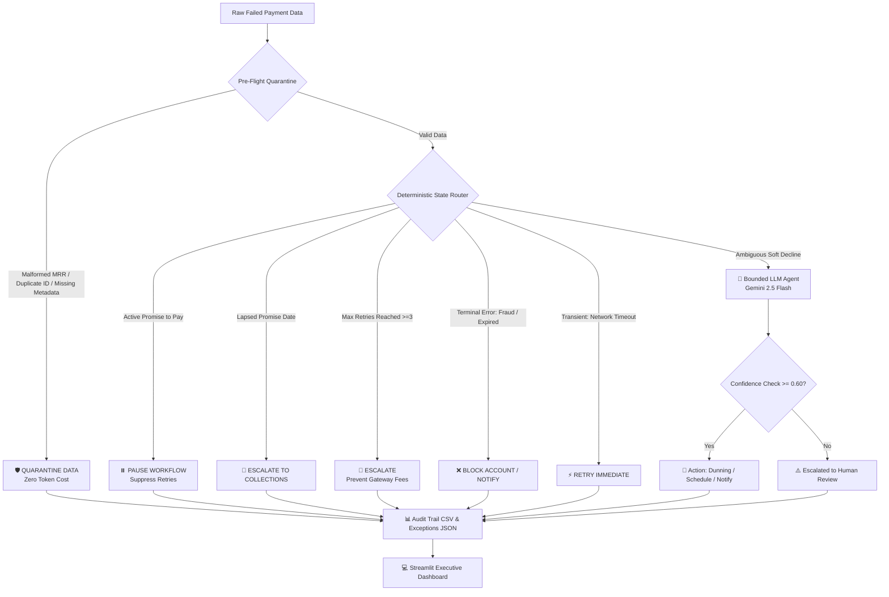

<div align="center">

# 💸 Recover.ai
### State-Aware AI Orchestration Engine for Subscription Revenue Recovery

[](https://python.org)
[](https://ai.google.dev/)
[](https://streamlit.io)
[](https://pydantic.dev)
[](https://pytest.org)

<p align="center">
  <b>Stop hemorrhaging SaaS MRR to naive retries and LLM hallucinations.</b><br>
  Recover.ai combines a <i>Zero-Token Deterministic Safety Engine</i> with <i>Bounded Gemini 2.5 Flash Reasoning</i> to recover failed payments safely, cost-effectively, and with 100% auditability.
</p>

---

</div>

## 📌 Executive Summary

Throwing raw AI at failed subscription payments is dangerous and expensive. Standard LLM wrappers suffer from:
1. **API Token Drain:** Wasting expensive LLM tokens processing malformed or simple terminal errors.
2. **Gateway Penalty Fees:** Naively retrying expired or fraudulent cards triggers bank fee penalties.
3. **Broken Customer Trust:** Ignoring customer "Promise-to-Pay" commitments damages user relationships.

**Recover.ai solves this through a hybrid two-tier architecture:**
- **Tier 1 (Deterministic Engine):** Intercepts data quality errors, terminal failures, and active time-based promises **at zero API cost**.
- **Tier 2 (Bounded AI Reasoning):** Uses **Gemini 2.5 Flash** with strict **Pydantic schemas** to diagnose soft-declines and craft smart dunning strategies.

---

## ⚡ Key Highlights & Features

* 🛡️ **Zero-Token Pre-Flight Quarantine:** Traps missing IDs, duplicate transactions, negative MRR, and malformed types before reaching the LLM.
* ⏱️ **Time-Aware State Machine:** Tracks customer `PROMISE_TO_PAY` arrangements, suppressing retries until due dates or auto-escalating to collections if lapsed.
* 🚦 **Deterministic Safety Rails:** Hard-stops terminal codes (`expired_card`, `suspected_fraud`) and enforces maximum retry caps (>=3 attempts) to prevent gateway penalties.
* 🧠 **Bounded AI Reasoning (Gemini 2.5 Flash):** Evaluates complex soft-declines (`insufficient_funds`, `do_not_honor`) with structured JSON schema outputs.
* 🎛️ **Low-Confidence Circuit Breaker:** Automatically overrides AI proposals if confidence falls below `0.60`, rerouting to human review queues.
* 📊 **Executive Dashboard & Interactive Live Tester:** Real-time Streamlit dashboard featuring multi-metric financial funnels, filterable audit trails, and live scenario testing.

---

## 🏗️ System Architecture



---

## 📂 File & Directory Architecture

```text
RazorPay/
├── 📄 main.py               # Central Pipeline Runner & Metric Calculator
├── 📄 router.py             # Pre-Flight Quarantine & Deterministic State Machine
├── 📄 agent.py              # Bounded Gemini 2.5 Flash Agent (Pydantic Schema)
├── 📄 app.py                # Streamlit Executive Dashboard & Live Judge Tester
├── 📄 data_gen.py           # Synthetic Stateful Payment Dataset Generator
├── 📄 inject_chaos.py       # Adversarial Chaos Data Corruptor
├── 📄 test_router.py        # Pytest Unit Test Suite for Router & Edge Cases
├── 📄 requirements.txt      # Python Project Dependencies
├── 📄 .env.example          # API Key Environment Variable Template
├── 📄 workflow_payments.json # Input Payment Dataset (75 Stateful Records)
├── 📊 audit_trail.csv       # Output Deliverable: Full Decision & Financial Audit Log
└── 📋 exceptions_report.json # Output Deliverable: Structured Exceptions & Escalations
```

### Module Breakdown

| Module | Description & Responsibility | Core Functions / Classes |
| :--- | :--- | :--- |
| **[`router.py`](file:///C:/Users/Lenovo/OneDrive/Desktop/RazorPay/router.py)** | First-line defense. Handles data sanitation, time-based state evaluation, and rule-based decision routing. | `deterministic_router()` |
| **[`agent.py`](file:///C:/Users/Lenovo/OneDrive/Desktop/RazorPay/agent.py)** | Second-line orchestrator. Invokes Gemini 2.5 Flash with strict JSON schema constraints for ambiguous declines. | `process_with_agent()`, `AgentDecision` |
| **[`main.py`](file:///C:/Users/Lenovo/OneDrive/Desktop/RazorPay/main.py)** | Batch orchestrator. Coordinates data ingestion, routing execution, circuit breaker overrides, and metric compilation. | `run_recovery_pipeline()` |
| **[`app.py`](file:///C:/Users/Lenovo/OneDrive/Desktop/RazorPay/app.py)** | Web UI powered by Streamlit. Displays financial recovery metrics, transparent logs, and a live transaction sandbox. | `load_data()`, Live Form Handler |
| **[`data_gen.py`](file:///C:/Users/Lenovo/OneDrive/Desktop/RazorPay/data_gen.py)** | Generates realistic, stateful transactions with edge cases (lapsed dates, missing tiers, variable attempt counts). | `generate_messy_batch()` |
| **[`inject_chaos.py`](file:///C:/Users/Lenovo/OneDrive/Desktop/RazorPay/inject_chaos.py)** | Injects corrupted records (negative MRR, non-numeric strings, missing IDs) to test pre-flight guardrails. | `inject_adversarial_data()` |
| **[`test_router.py`](file:///C:/Users/Lenovo/OneDrive/Desktop/RazorPay/test_router.py)** | Comprehensive test suite validating duplicate detection, negative MRR quarantine, and state transitions. | Pytest test cases |

---

## 🧠 Decision Routing Matrix

| Failure Code / Condition | Handler Engine | Action Taken | Business Rationale | API Cost |
| :--- | :--- | :--- | :--- | :--- |
| Missing `txn_id` or Duplicate ID | **Pre-Flight Quarantine** | `QUARANTINE_DATA` | Prevent MRR double counting & data pollution | **$0.00** |
| Negative / Malformed `mrr_value` | **Pre-Flight Quarantine** | `QUARANTINE_DATA` | Data sanitization safeguard | **$0.00** |
| Active `PROMISE_TO_PAY` (Future Date) | **Time-Aware State Machine** | `PAUSE_WORKFLOW` | Respect customer payment agreement | **$0.00** |
| Lapsed `PROMISE_TO_PAY` (Past Date) | **Time-Aware State Machine** | `ESCALATE_TO_COLLECTIONS` | Breach of payment promise agreement | **$0.00** |
| Attempt Count `>= 3` | **Safety Rails** | `ESCALATE` | Stop retry spam to eliminate gateway penalty fees | **$0.00** |
| `expired_card` | **Safety Rails** | `NOTIFY_CUSTOMER` | Terminal card failure; request card update | **$0.00** |
| `suspected_fraud` | **Safety Rails** | `BLOCK_ACCOUNT` | Terminal security threat; immediate halt | **$0.00** |
| `network_timeout` | **Safety Rails** | `RETRY_IMMEDIATE` | Pure transient technical failure | **$0.00** |
| Missing `customer_tier` | **Safety Rails** | `MANUAL_REVIEW` | Insufficient metadata for dunning strategy | **$0.00** |
| `insufficient_funds` / `do_not_honor` | **Gemini 2.5 Flash Agent** | `SCHEDULE_DUNNING` / `ESCALATE_TO_HUMAN` | Requires intelligent timing & customer history context | Dynamic |

---

## 🚀 Getting Started

### 1. Prerequisites
- Python 3.10 or higher
- Gemini API Key ([Get an API Key](https://aistudio.google.com/))

### 2. Installation & Configuration

Clone the repository and install dependencies:
```bash
git clone https://github.com/your-username/RazorPay.git
cd RazorPay
pip install -r requirements.txt
```

Set up your environment variables:
1. Copy `.env.example` to `.env`:
   ```bash
   cp .env.example .env
   ```
2. Open `.env` and insert your Gemini API Key:
   ```env
   GEMINI_API_KEY="your_actual_gemini_api_key_here"
   ```

### 3. Pipeline Execution Steps

#### Step A: Generate Realistic Stateful Data
```bash
python data_gen.py
```
*Generates 75 realistic payment transactions in `workflow_payments.json` containing stateful promise dates and metadata edge cases.*

#### Step B: Inject Chaos (Adversarial Data Testing)
```bash
python inject_chaos.py
```
*Corrupts records with negative MRR values, string types, and missing IDs to prove guardrail quarantine capabilities.*

#### Step C: Run Recovery Pipeline
```bash
python main.py
```
*Processes the batch, routes transactions through safety rails and AI agent, and generates `audit_trail.csv` and `exceptions_report.json`.*

#### Step D: Run Pytest Suite
```bash
python -m pytest -v
```
*Verifies all deterministic routing rules and edge-case quarantine assertions pass.*

---

## 💻 Interactive Streamlit Dashboard

Launch the visual dashboard and live transaction judge sandbox:

```bash
python -m streamlit run app.py
```

### Dashboard Features:
1. **Executive Financial Summary:** Overview of Total Processed MRR, Actual Recovered MRR, Paused MRR, Pending MRR, and Confirmed Unrecoverable MRR.
2. **Live Judge Testing Sandbox:** Form to input custom transactions (e.g., entering text into the MRR field to test zero-cost quarantine live).
3. **Filterable Audit Log:** Full table view displaying every decision, diagnosis, confidence score, and human-readable reasoning.
4. **Exceptions & Escalation Queue:** Dedicated tracking for high-risk actions, data quality quarantines, and low-confidence AI overrides.

---

## 🛡️ Reliability & Safety Architecture

```text
┌────────────────────────────────────────────────────────┐
│                   SAFETY & COST ENGINE                 │
├────────────────────────┬───────────────────────────────┤
│ Zero Token Consumption │ Hard business rules filter    │
│                        │ ~60-70% of transactions       │
├────────────────────────┼───────────────────────────────┤
│ Gateway Protection     │ Hard stop at max 3 retries    │
│                        │ to avoid bank fines           │
├────────────────────────┼───────────────────────────────┤
│ Schema Validation      │ Strict Pydantic parsing       │
│                        │ eliminates malformed JSON     │
├────────────────────────┼───────────────────────────────┤
│ Confidence Circuit     │ AI confidence < 0.60 forces   │
│ Breaker                │ human escalation              │
└────────────────────────┴───────────────────────────────┘
```

---

## 📄 Deliverables Summary

- 📊 **`audit_trail.csv`**: Granular breakdown of every transaction processed, identifying handler engine, diagnosis, decision, confidence score, reasoning, and actual simulated recovery status.
- 📋 **`exceptions_report.json`**: Categorized JSON list of all quarantined data, human escalations, collections transfers, and manual review items.

---

<div align="center">
  <sub>Built with ❤️ using Python, Google Gemini 2.5 Flash, Pydantic, and Streamlit.</sub>
</div>